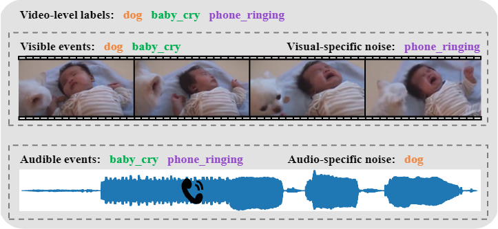
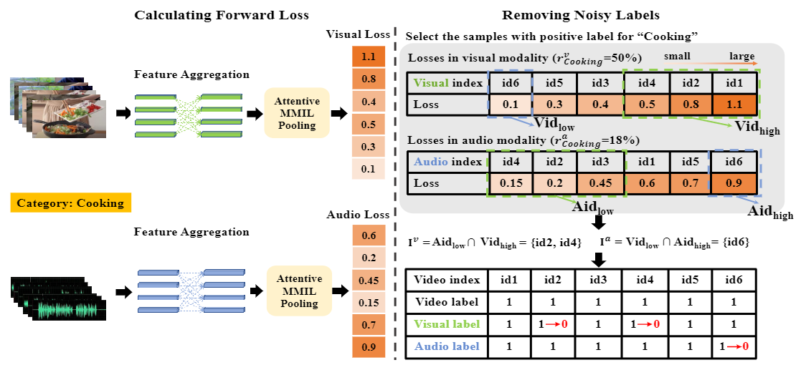
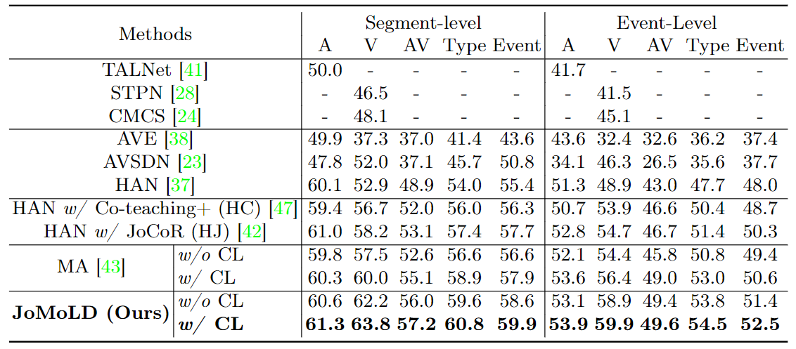

## Joint-Modal Label Denoising for Weakly-Supervised Audio-Visual Video Parsing

[Haoyue Cheng](https://scholar.google.com/citations?user=hg0h5YEAAAAJ&hl=zh-CN&oi=ao), [Zhaoyang Liu](https://scholar.google.com/citations?user=btgwZosAAAAJ&hl=zh-CN&oi=ao), [Hang Zhou](https://scholar.google.com/citations?user=iqbKD9UAAAAJ&hl=zh-CN&oi=ao), [Chen Qian](https://scholar.google.com/citations?user=AerkT0YAAAAJ&hl=zh-CN&oi=ao), [Wayne Wu](https://scholar.google.com/citations?user=uWfZKz4AAAAJ&hl=zh-CN&oi=ao) and [Limin Wang](https://scholar.google.com/citations?user=HEuN8PcAAAAJ&hl=zh-CN&oi=ao)

Code for ECCV 2022 paper [Joint-Modal Label Denoising for Weakly-Supervised Audio-Visual Video Parsing](https://arxiv.org/abs/2204.11573)


## Paper Overview


### Modality-specific label noise




### The procedure of modality-specific label denoising



### The results on LLP dataset



## Get Started


### Prepare data

1. Please download the preprocessed audio and visual features from https://github.com/YapengTian/AVVP-ECCV20.
2. Put the downloaded features into data/feats/.


### Train the model

1.Train noise estimator:
```bash
python main.py --mode train_noise_estimator --save_model true --model_save_dir ckpt --checkpoint noise_estimater.pt
```
2.Calculate noise ratios:
```bash
python main.py --mode calculate_noise_ratio --model_save_dir ckpt --checkpoint noise_estimater.pt --noise_ratio_file noise_ratios.npz
```
3.Train model with label denoising:
```bash
python main.py --mode train_label_denoising --save_model true --model_save_dir ckpt --checkpoint JoMoLD.pt --noise_ratio_file noise_ratios.npz
```

### Test

We provide the pre-trained JoMoLD [checkpoint](https://drive.google.com/drive/folders/1eaQCk2OJ0IMdfTj0sRjZ7aVQkVxs0-1y?usp=sharing) for evaluation. 
Please download and put the checkpoint into "./ckpt" directory and use the following command to test:
```bash
python main.py --mode test_JoMoLD --model_save_dir ckpt --checkpoint JoMoLD.pt
```


### Citation

If you find this work useful, please consider citing it.

<pre><code>@article{cheng2022joint,
  title={Joint-Modal Label Denoising for Weakly-Supervised Audio-Visual Video Parsing},
  author={Cheng, Haoyue and Liu, Zhaoyang and Zhou, Hang and Qian, Chen and Wu, Wayne and Wang, Limin},
  journal={Proceedings of the European Conference on Computer Vision (ECCV)},
  year={2022}
}
</code></pre>


